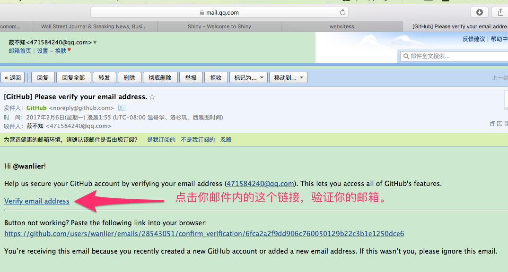
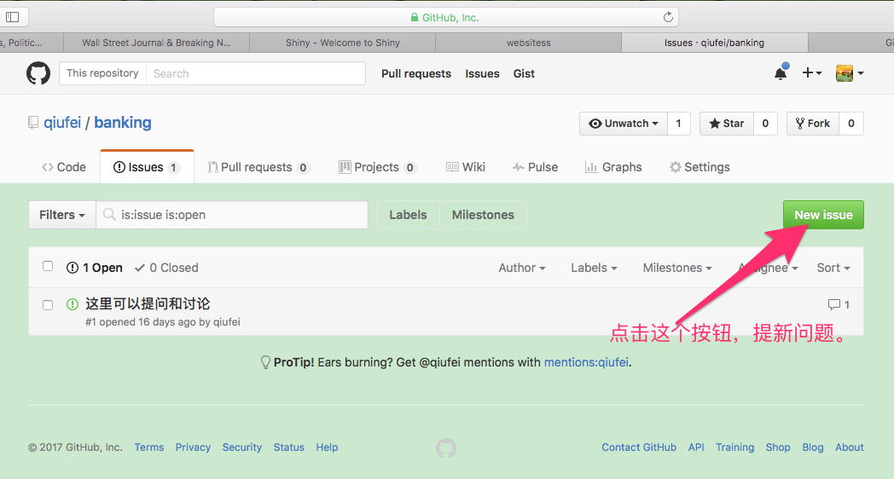

# 互联网金融智能交易操作

本课程主要解决两个问题：

1. 在互联网时代如何获取数据；
2. 如何搭建自己的数据分析平台。

本课程这个fancy的名字是学校课程大纲规定的，其实我觉得叫“基于R语言的金融数据分析平台搭建与实践”更合适。

本课程名字中所言的“操作”，主要是指获取数据的操作和分析数据的操作。至于金融投资操作，这个看天分的，有些人就是很适合，详见本页第四部分的小故事。本人金融投资操作天分一般般。（如果买股票亏损的水平可以称为一般般的话😳）

## 一、课程PPT

### 理论部分

[第一章 导论](https://rawgit.com/qiufei/rnet/master/PPT/01-intro.html)
[第一章备用地址](http://htmlpreview.github.io/?https://github.com/qiufei/rnet/blob/master/PPT/01-intro.html)

[第二章 智能交易操作的工具：以R语言为例](https://rawgit.com/qiufei/rnet/master/PPT/02-Rtool.html) 
[第二章备用地址](http://htmlpreview.github.io/?https://github.com/qiufei/rnet/blob/master/PPT/02-Rtool.html)

[第三章 网络数据的获取和使用 ：Quandl](https://rawgit.com/qiufei/rnet/master/PPT/03-quandl.html)
[第三章备用地址](http://htmlpreview.github.io/?https://github.com/qiufei/rnet/blob/master/PPT/03-quandl.html)

[第四章 利用Rmarkdown生产可重复的报告](https://rawgit.com/qiufei/rnet/master/PPT/04-report.html)
[第四章备用地址](http://htmlpreview.github.io/?https://github.com/qiufei/rnet/blob/master/PPT/04-report.html)

[第五章 智能交易的云计算平台：以DigitalOcean为例](https://rawgit.com/qiufei/rnet/master/PPT/05-digitalocean.html)
[第五章备用地址](http://htmlpreview.github.io/https://github.com/qiufei/rnet/blob/master/PPT/05-digitalocean.html?)

[第六章 交易设计实例](https://rawgit.com/qiufei/rnet/master/PPT/06-project.html)
[第六章备用地址](http://htmlpreview.github.io/?https://github.com/qiufei/rnet/blob/master/PPT/06-project.html)

第七章时间不够的话就不讲，因为我自己也没有实际操作过，所以能讲的东西很少😳。

[第七章 高频交易 PPT](https://rawgit.com/qiufei/rnet/master/PPT/07-highfrequence.html)

* 如果因为网络原因打不开链接，可以在这里下载[html源文件](https://github.com/qiufei/rnet/tree/master/PPT)到本地用浏览器打开。

### 操作部分

[0-git基本操作](https://rawgit.com/qiufei/rnet/master/operation/0-git基本操作.html)
[0备用地址](http://htmlpreview.github.io/?https://github.com/qiufei/rnet/blob/master/operation/0-git基本操作.html)

[1-数据集分组与筛选](https://rawgit.com/qiufei/rnet/master/operation/1-数据集分组与筛选.html)
[1备用地址](http://htmlpreview.github.io/?https://github.com/qiufei/rnet/blob/master/operation/1-数据集分组与筛选.html)

[2-数据集清洗](https://rawgit.com/qiufei/rnet/master/operation/2-数据集清洗.html)
[2备用地址](http://htmlpreview.github.io/?https://github.com/qiufei/rnet/blob/master/operation/2-数据集清洗.html)

[3-金融市场的波动性](https://rawgit.com/qiufei/rnet/master/operation/3-金融市场的波动性.html)
[3备用地址](http://htmlpreview.github.io/?https://github.com/qiufei/rnet/blob/master/operation/3-金融市场的波动性.html)

[4-一个天真的买入低价的策略](https://rawgit.com/qiufei/rnet/master/operation/4-一个天真的买入低价的策略.html)
[4备用地址](http://htmlpreview.github.io/?https://github.com/qiufei/rnet/blob/master/operation/4-一个天真的买入低价的策略.html)

* 如果因为网络原因打不开链接，可以在这里下载[html源文件](https://github.com/qiufei/rnet/tree/master/operation)到本地用浏览器打开。

操作部分主要是使用[dplyr](https://cran.r-project.org/web/packages/dplyr/)宏包进行数据操作，用[ggplot2](https://cran.r-project.org/web/packages/ggplot2/index.html)宏包进行画图。

有兴趣的同学可以先自己摸索这两个宏包。

## 二、互动讨论区

关于课程的提问和讨论，可以到课程的互动讨论区进行，网址如下：

<https://github.com/qiufei/rnet/issues>

也欢迎对本课程和老师的授课进行批评吐槽，我看到会努力改进。

要在这里讨论提问或者吐槽的话，首先要有githud账户，然后在哪个讨论界面发帖。下面讲解如何做这两步。

### （一）吐槽先在github网站注册新账户

github网站网址<https://github.com>

> **建议大家用自己“姓名全拼+学号后四位”作为用户名，这样我可以根据大家的发言讨论情况，给平时成绩加分。**

比如,学号20169201314的韩梅梅同学，建议用户名为hanmeimei1314。

1.填写注册信息

2.完成账户注册

3.验证账户邮箱

### （二）创建Issues，自己提新的问题。

注册账户后，登陆你的github账户，然后打开这个网址<https://github.com/qiufei/rnet/issues>，可以在此进行提问和讨论。

**注意:这里的截图是另一门课程的，但是方法是一致的**

方法如下：

1. 新建Issue

2.发帖提问

3.当然你也可以对已经存在的老issue，回帖进行讨论。 

## 三、公共Rstudio服务器

### 本课程的作业服务器wstudio

* 本课的公共rstudio服务器网址是

<http://138.197.206.152:8787>

由于只有单核，512内存，一个账号一次只能登陆一个人，所以不建议大家不要直接登陆。

### 公共服务器的主要目的是做家庭作业用

* 本课程的家庭作业主页是：

<https://wanlier.github.io/wstudio/>

* 如果利用服务器做家庭作业，作业主页有说明

## 四、捐助与一个故事

### 本课程对互联网世界的捐助

互联网世界的发展得益于众多人无私的捐助，我自己从互联网的世界获益很多。

这门课虽然只是一门选修课课程，但是对于那些想用R语言，又不知道如何与实际操作需求对应的人，会有小小的入门级帮助。

这里我介绍了如何用R及相关工具搭建一个信息分析框架平台。

这算作我对互联网世界的一个个小小的回馈吧。

### 本课程需要捐助的地方

在我的这门课程中，我最不满意的地方在于真实交易数据的缺失。我是用Quandl宏包来获取google finance上的股票交易数据。

然而google finance的中国股市数据经常出现错误和遗漏，这对深入分析数据是个很大的障碍，因为拿着错误的数据做，你会发现一些诡异和难以解释的现象。

所以，如果有人能提供准确完整的中国股市历史交易数据，帮助本课程的改进，我将不胜感激！

### 一个故事

互联网时代，凡是要做啥事，都要讲一个故事，尤其是捐助或者融资这种。

既然我希望有人能捐助我数据，于是我也需要讲一个故事。

我读研究生的时候，上过一门证券投资的选修课，上课的老师被誉为股神。（如果我的研究生同学看到这里的话，是的，你猜得没错，我说的就是[黄老师](https://qiufei.github.io/it-is-sheer-good-fortune-to-miss-somebody-long-before-they-leave-you/)😏）

那位老师讲，他每天开盘前，会把几千只股票的K线图快速看一遍，然后就能大致了解了那些股票具有投资机会。

当时，我还没有炒过股，也没想过成为巴菲特，但是听他这么说的时候，我就想，我要是也有他这种“扫描眼”的能力该多好。

这个念头虽然在上课时很强烈，但是后来也就逐渐淡了，毕竟成为武林高手，是要有天赋的，我的肉眼可能就没有“扫瞄眼”的潜质。

毕业后很多年，我也没买过股票。

后来，我接触到了R语言，我发现我可以用R语言来模拟老师“扫瞄眼”的一些功能。

我可以用R获得整个股市的历史数据，然后按照我定义的规则，筛选出一些股票，也可以做到在股票开盘前，把全部市场股票扫描一遍，找出自认为有价值的股票。

虽然，只是模拟了老师扫描的功能，而没有模拟到赚钱的功能。🤦

不过，我想，如果有更好的数据，更好的扫描方法的话，效果会更好的吧。（容我YY一下😳）

好了，跟捐助相关的故事讲完了，按照互联网惯例，我需要给我的故事（即那个模拟老师“扫描”功能的念头）做一个文艺的总结，这就叫：

> 恋恋不忘，必有回响，从你意想不到的方向。
